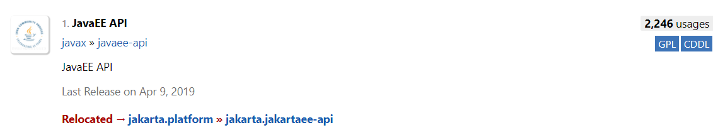
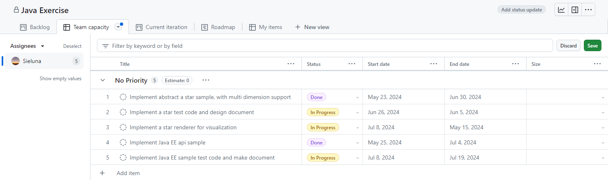

- [The Introduction Of The JAX-RS](#introduction)
- [Task List](#tasks)
  - [Implement a Heartbeat Endpoint](#1-implement-a-heartbeat-endpoint)
  - [Implement a Todo List Endpoint](#2-implement-a-todo-list-endpoint)
  - [Let's Design a Web Page](#3-lets-design-a-web-page)
  - [Make Server Data Flow](#4-make-server-data-flow)

# Introduction

Java EE, now known as Jakarta EE, embodies the principle that "third-tier
companies make products, second-tier companies design technology, and first-tier
companies set standards." Though it has greatly benefited the Java community as
an official standard, its practical implementation has lagged, making it more of
a reference point than a strict standard. Nevertheless, it remains a valuable
resource due to its extensive documentation and enterprise-oriented development
approach.

JAX-RS, or Java API for RESTful Web Services, is a part of Java EE that
standardizes the creation of RESTful web services, thereby simplifying the
development of HTTP-based services. It was introduced in December 2009 with Java
EE 6 under [JSR 311](https://jcp.org/en/jsr/detail?id=311).

In this exercise, we will explore key specifications in Java EE through its
documentation and implement the required logic within the framework. By
mastering these coding rules and design specifications, you will be
well-equipped to proficiently use all Java web frameworks.

> [!NOTE]
> The transition from javax to jakarta happened because Oracle transferred Java
> EE specifications to the Eclipse Foundation, which required a new namespace
> due to Oracle retaining rights to javax.


# Tasks

## 1. Implement a Heartbeat Endpoint

### Instruction:

For a professional web service, especially in a multi-service application,
creating a heartbeat endpoint is important. This endpoint will indicate that the
server is alive and functional by returning the current server time. To
effectively manage multiple fields, we can encapsulate them into a JSON object.

In this exercise, we will utilize the Java EE REST API as defined in
[JSR 311](https://jcp.org/en/jsr/detail?id=311) and refer to the official
documentation in the
**[Jakarta REST Tutorial](https://jakarta.ee/learn/docs/jakartaee-tutorial/current/websvcs/jaxrs/jaxrs.html)**.
Additionally, we will use the Java EE JSON API as defined in
[JSR 353](https://jcp.org/en/jsr/detail?id=353) and refer to the official
documentation in the
**[Jakarta JSON Processing Tutorial](https://jakarta.ee/learn/docs/jakartaee-tutorial/current/web/jsonp/jsonp.html)**

### Procedural:

1. **Set up your project environment**: Ensure your project is properly
configured and run Gradle sync to install dependencies correctly.

> [!Important]
> The project testing uses the Java SE environment, Pay close attention to the
> differences between environments.

2. **Define the endpoint**: Use JAX-RS annotations to define the endpoint and
implement the logic in `resources/HeartBeatResource.java`.

### Requirement:

* **Endpoint**: _**/api/heartbeat**_
* **Method**: `GET`
* **Response**: JSON object containing the current server time, e.g.:
  ```json
  {
    "status": "alive",
    "time": "1970-01-01T00:00:00Z"
  }
  ```

<details>
  <summary>Hint:</summary>
  <ul>
    <li>Use <code>@Path</code>, <code>@GET</code>, and <code>@Produces</code> annotations to define the endpoint and specify the response type.</li>
    <li>Utilize <code>LocalDateTime.now()</code> to get the current server time. Required <code>ISO</code> standard date time.</li>
    <li>Use <code>Json.createObjectBuilder</code> or <code>Json.createParser</code> to parse json object.</li>
  </ul>
</details>

## 2. Implement a Todo List Endpoint

### Instruction:

The todo list is a popular example in web development and serves as an excellent
starting point to understand RESTful API design.

In this task, you will learn the **J**ava EE **P**ersistence **A**PI as defined in
[JSR 317](https://jcp.org/en/jsr/detail?id=317) and refer to the official
documentation in the
**[Jakarta Persistence Tutorial](https://jakarta.ee/learn/docs/jakartaee-tutorial/current/persist/persistence-intro/persistence-intro.html)**,
and serialize classes into JSON refer to the official
documentation in the
**[Jakarta JSON Binding Tutorial](https://jakarta.ee/learn/docs/jakartaee-tutorial/current/web/jsonb/jsonb.html)**.
Implement a minimal API following these guidelines.

### Requirement:

#### Get all Tasks

* **Endpoint**: _**/api/todos**_
* **Method**: `GET`
* **Response**: JSON array of tasks from the database, e.g.:
```json
[
  {
    "id": 1,
    "title": "Learn Java",
    "description": "Java is a high-level, class-based, object-oriented programming language.",
    "startDate": "1970-01-01T00:00:00Z",
    "endDate": "1970-01-10T23:59:59Z",
    "status": "Todo",
    "boardId": 1,
    "assignerId": 1
  },
  {
    "id": 2,
    "title": "Learn Rust",
    "description": "Rust is the best programming language in the world.",
    "startDate": "1970-01-01T00:00:00Z",
    "endDate": "1970-01-10T23:59:59Z",
    "status": "Done",
    "boardId": 1,
    "assignerId": 1
  }
]
```

#### Get one Task by ID

* **Endpoint**: _**/api/todos/:id**_
* **Method**: `GET`
* **Response**: JSON object of the task with the specified ID, e.g.:
```json
{
  "id": 1,
  "title": "Learn Java",
  "description": "Java is a high-level, class-based, object-oriented programming language.",
  "startDate": "1970-01-01T00:00:00Z",
  "endDate": "1970-01-10T23:59:59Z",
  "status": "Todo",
  "boardId": 1,
  "assignerId": 1
}
```

#### Save one task

* **Endpoint**: _**/api/todos**_
* **Method**: `POST`
* **Request**: JSON object with new task details, e.g.:
```json
{
  "title": "Learn Sleep",
  "description": "zzz...",
  "endDate": "1970-01-10T23:59:59Z",
  "status": "Todo",
  "boardId": 1,
  "assignerId": 1
}
```
* **Response**: JSON object of the newly created task, e.g.:
```json
{
  "id": 3,
  "title": "Learn Sleep",
  "description": "zzz...",
  "startDate": "1970-01-01T00:00:00Z",
  "endDate": "1970-01-10T23:59:59Z",
  "status": "Todo",
  "boardId": 1,
  "assignerId": 1
}
```

#### Update one Task by ID

* **Endpoint**: _**/api/todos/:id**_
* **Method**: `PUT`
* **Request**: JSON object with the fields to update, e.g.:
```json
{
  "status": "Done"
}
```
* **Response**: JSON object of the updated task, e.g.:
```json
{
  "id": 3,
  "title": "Learn Sleep",
  "description": "zzz...",
  "startDate": "1970-01-01T00:00:00Z",
  "endDate": "1970-01-10T23:59:59Z",
  "status": "Done",
  "boardId": 1,
  "assignerId": 1
}
```

#### Remove one task by id

* **Endpoint**: _**/api/todos/:id**_
* **Method**: `DELETE`
* **Response**: Status code indicating successful deletion.

### Procedural:

To make the exercise more valuable, we will refer to the
[GitHub project panel](https://docs.github.com/zh/issues/planning-and-tracking-with-projects/learning-about-projects/quickstart-for-projects).


*Figure 1: GitHub Projects layout.*

1. **Summarize the GitHub projects page**: the core content includes tasks, task
status and users. Let's place all key components on a canvas and connect them
with lines.

    ```mermaid
      erDiagram
        users {
          int id PK
          string name
        }
        boards {
          int id PK
        }
        user_board {
          int user_id FK
          int board_id FK
        }
        statuses {
          int id PK
          string name
          int board_id FK
        }
        tasks {
          int id PK
          string title
          string description
          datetime startDate
          datetime endDate
          int status_id FK
          int board_id FK
          int assigner_id FK
        }
      
        users ||--o{ tasks: "assigner_id:id"
        boards ||--o{ statuses : "board_id:id"
        boards ||--o{ tasks : "board_id:id"
        statuses ||--o{ tasks : "status_id:id"
        users ||--o{ user_board : "user_id:id"
        boards ||--o{ user_board: "board_id:id"
    ```

2. **Design the entity repository for CRUD operations**: Ensure that the N+1
problem is avoided. Implement the todo list endpoint.

<details>
  <summary>Hint:</summary>
  <ul>
    <li>Use <code>@Path</code>, <code>@GET</code>, <code>@POST</code>, <code>@DELETE</code>, and <code>@Produces</code> annotations to define the endpoints and specify the response type.</li>
    <li>Build up the entities relationship by <code>@Entity</code>, <code>@Id</code>, <code>@ManyToOne</code>, <code>@OneToMany</code> and <code>@ManyToMany</code>.</li>
    <li>Implement the repositories logic to manage the entities.</li>
  </ul>
</details>

## 3. Let's Design a Web Page

### Instruction:

In this task, we aim to create a web page that allows users to manage their todo
list. To achieve this, we will utilize web components. Given that tasks and
their statuses are highly independent and require interactivity, web components
will enable efficient encapsulation of the logic and behavior for these
interactive elements. This will allow users to drag and drop tasks between
different statuses seamlessly.

### Details:

* **Endpoint**: _**/**_
* **Method**: `GET`
* **Response**: An HTML page displaying the list of todos and a form to add new tasks.
  - A table or list to display the current todo items.
  - A form with an input field for adding new tasks.
  - Include buttons for update or delete tasks.

## 4. Make Server Data Flow

### Instruction:

In reality, a server often does not serve only one person, we need to make the
data flow. 